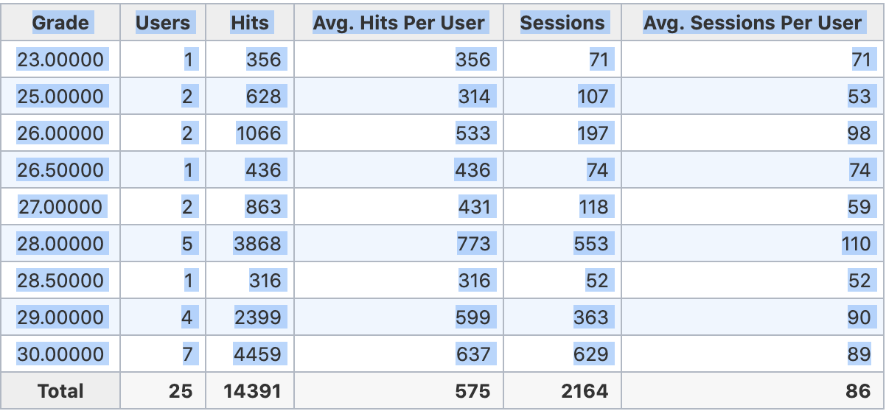

# myUMBC Grade Distribution Statistics

A Python script to generate statistics from myUMBC/Blackboard's grade distribution.

### Requirements:

The script is run using Python 3.
> **Note:** You may need to use `python3` before your commands to ensure you use the correct Python path. e.g. `python3 --version`

```bash
python --version

-- or --

python3 --version
```


### Installation and set up:

You may want to create a virtual environment before installation, although it's not required, as long as you have the required packages.

**Using PyPi (pip):**

In your terminal, in the root directory of the repository, type the following:

```bash
$ pip3 install -r requirements.txt

-- or, if your pip defaults to python3 --

$ pip install -r requirements.txt
```

### Basic Usage

Select and copy the grades from the table on the myUMBC page.


**As demonstrated in the figure above, do not include the last line** 
Create a file in the root directory named 'grades.csv', containing the grade distribution pasted in.

Run the following in the root directory:

```bash
$ python3 gradeStats.py
```

### TODO:
* Take command line arguments for filename, default to filename "grades.csv"
* Add more statistics, such as median, mode
* Add an option to take multiple filenames, or a directory full of CSV files, to calculate statistics for different assignments
* Access HTML directly and scrape it to automate the process further
* Alternatively, simply write a JS script that the user can copy paste into their console, and scrap the Python version.

<!-- Markdown links -->
